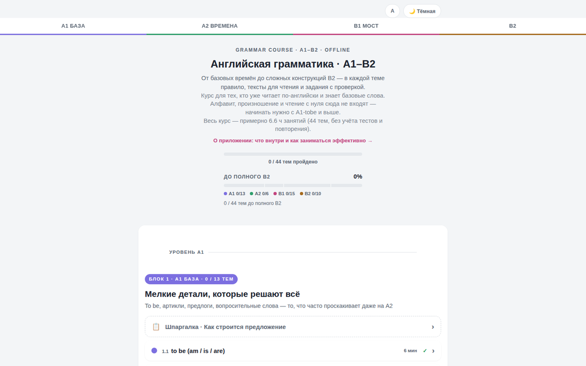

# Английская грамматика A1–B2

<picture>
  <source media="(prefers-color-scheme: dark)" srcset="assets/screenshot-dark.png">
  <source media="(prefers-color-scheme: light)" srcset="assets/screenshot-light.png">
  
</picture>

Офлайн-курс английской грамматики для самостоятельного изучения. Один HTML-файл, без сервера, без регистрации, без рекламы.

**Открыть демо:** https://english-prep.netlify.app/

## Что внутри

- **38 тем от A1 до B2** — базовые времена, модальные глаголы, страдательный залог, условные предложения (включая Third и Mixed Conditional), каузатив и другие конструкции продвинутого уровня
- Каждая тема: **правило** (с примерами, сравнением похожих конструкций и разбором типичных ошибок) → **тексты для чтения** (истории, диалоги на бытовые темы) → **задания** с автопроверкой
- **Итоговый тест** на 12 вопросов по основным временам
- **«Стоит повторить»** — блок сам подсвечивает темы с высоким процентом ошибок в квизах
- **Метр прогресса до полного B2** — честно считает и уже написанные темы, и то, что ещё в планах, а не только пройденное из готового
- Бонус: адаптированная книга для чтения («Around the World in 80 Days»), закрепляет грамматику из пройденных тем в связной истории
- Тёмная тема и регулировка размера шрифта
- Прогресс сохраняется локально в браузере (localStorage) — никакие данные никуда не отправляются

## Технологии

Чистый HTML/CSS/JavaScript. Без фреймворков, без сборки, без зависимостей — открывается напрямую в браузере.

## Как запустить

Скачай `index.html` и открой в любом браузере. Либо размести на GitHub Pages / Netlify / Vercel для доступа по ссылке.

## Кому подходит

Курс рассчитан на тех, кто уже читает по-английски и знает базовую лексику — это грамматика, а не курс с нуля. Алфавит, произношение и первые слова сюда не входят.

## Известные ограничения

- Шрифты (Manrope, Golos Text) подключаются через Google Fonts CDN — при самом первом открытии без интернета браузер покажет системные шрифты вместо них
- PWA-обёртки (manifest, service worker) пока нет — «Установить на экран» недоступно

## Автор

Stanislav Sidorovich · Алматы · LinkedIn

## Лицензия

MIT — см. LICENSE

---

## 🇬🇧 English

Offline, single-file English grammar course (A1–B2) — no backend, no build step, no framework. **Live demo:** https://english-prep.netlify.app/

38 topics, each with a rule (with contrast and common-mistakes notes), two reading texts, and an auto-checked quiz, plus a review-by-error-rate section and a progress meter toward a complete B2 level. Progress is stored in `localStorage`; nothing is sent anywhere. Built for learners who already read English and know basic vocabulary — this is a grammar course, not a from-scratch beginner course.